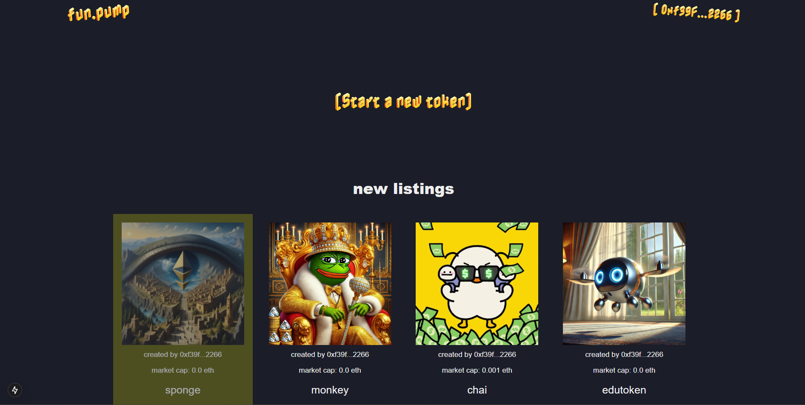
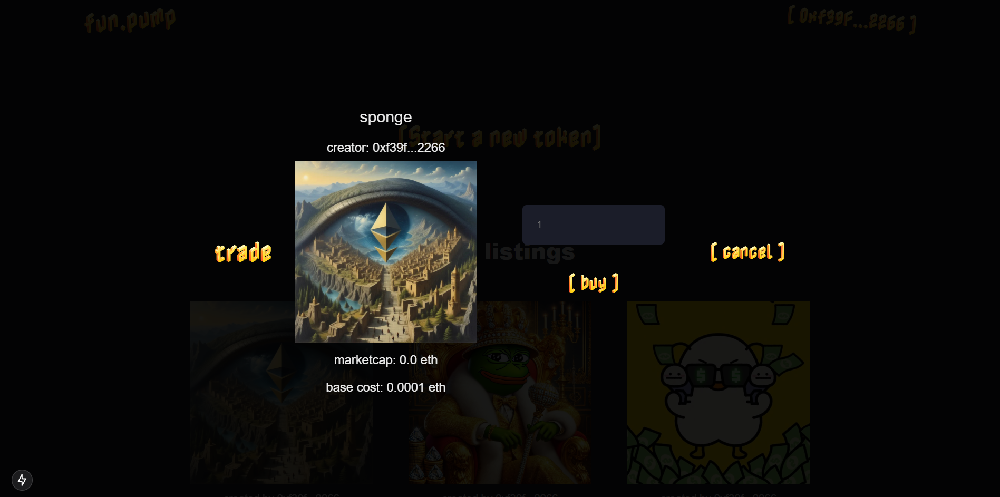

# fun.pump – Meme Coin Launchpad on Ethereum

Build your own decentralized meme coin launchpad (just like [Pump.fun](https://pump.fun)) with smart contracts in Solidity, front-end in React/Next.js, and wallet integration via MetaMask. This is a full-stack dApp enabling users to launch, list, and invest in meme tokens — built by following [this video tutorial by Gregory](https://www.youtube.com/watch?v=XYZ) and customized for learning and experimentation.

 <!-- Optional: Add a demo image -->
 <!-- Optional: Add a demo image -->

---

## ✨ Features

- ⚙️ **Factory Smart Contract** for deploying ERC20 tokens dynamically
- 💸 Fee mechanism for listing new meme coins
- 📈 Dynamic token pricing logic (cost increases as tokens are sold)
- 🛡️ Token sale state management (open/closed, sold, raised, limits)
- 🧪 Fully tested with **Mocha & Chai**
- 🌐 **Next.js** front-end with wallet integration (MetaMask)
- 🔄 Real-time state updates via Ethers.js
- 🧪 Local blockchain simulation with **Hardhat**

---

## 📦 Tech Stack

| Layer     | Tech                        |
|-----------|-----------------------------|
| Language  | Solidity, JavaScript        |
| Framework | Hardhat, Next.js            |
| Testing   | Mocha, Chai                 |
| Wallet    | MetaMask                    |
| Library   | Ethers.js                   |
| Frontend  | React.js, CSS               |
| Tools     | Node.js, VS Code, Hardhat Node |

---

## 🛠️ How It Works

1. **Deploy Factory Contract** locally or on EVM testnet.
2. **Create Tokens** via the front-end UI.
3. **Users can buy tokens** using ETH with dynamic pricing.
4. **Once sale target is reached**, creators can withdraw funds and remaining tokens.
5. **Platform owner can withdraw listing fees.**

---

## 🔧 Getting Started

### 1. Clone this repo
```bash
git clone https://github.com/gunjanghate/gg-pump-fun.git
cd gg-pump-fun
````

### 2. Install dependencies

```bash
npm install
```

### 3. Compile & Deploy Contracts (Local)

```bash
npx hardhat compile
npx hardhat node
npx hardhat ignition deploy ignition/modules/Factory.js --network localhost
```

### 4. Start Frontend

```bash
npm run dev
```

Make sure MetaMask is connected to your local Hardhat network (`http://127.0.0.1:8545`) and you import one of the Hardhat accounts.

---

## 🧪 Testing

```bash
npx hardhat test
```

Covers:

* Factory creation
* Token deployment
* Buy/sell logic
* Fee handling
* Access control
* Sale state validation

---

## 📁 Project Structure

```
├── contracts/
│   ├── Factory.sol
│   └── Token.sol
├── test/
│   └── Factory.test.js
├── app/
│   ├── components/
│   ├── abis/
│   ├── config.json
│   └── page.js
├── scripts/
│   └── deploy.js
├── hardhat.config.js
├── README.md
```

---

## 📚 Tutorial Summary

This project is based on Gregory’s YouTube guide for building a meme coin launchpad using Solidity and React. It walks you through writing and testing smart contracts, setting up a frontend with wallet interaction, and deploying to local EVM chains using Hardhat. You’ll learn:

* 🔐 Smart contract security best practices
* 📈 Sale logic with incremental pricing
* 🔗 Connecting blockchain to the frontend
* 💰 Managing ETH and token transfers securely
* 🧑‍💻 React state & effect hooks for blockchain updates

---

## 🧠 Key Takeaways

* ✅ **Learn-by-building**: Great for blockchain beginners
* 🏭 **Factory design pattern**: Deploy multiple tokens from a single contract
* 🔄 **Hardhat local testing**: Rapid dev + deploy cycles
* 📊 **On-chain economics**: Dynamic pricing, fee structures, sale state
* 🧩 **dApp UX**: Seamless wallet interaction with MetaMask

---

## 📢 Credits

Built by [@gunjanghate](https://github.com/gunjanghate) based on the tutorial by Gregory from Dapp University.

---

## 📜 License

MIT – feel free to fork, build, and expand.

---

## 🙌 Want to Contribute?

Pull requests are welcome! Let's build a better crypto playground together 🚀

```

